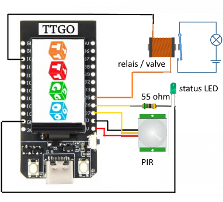
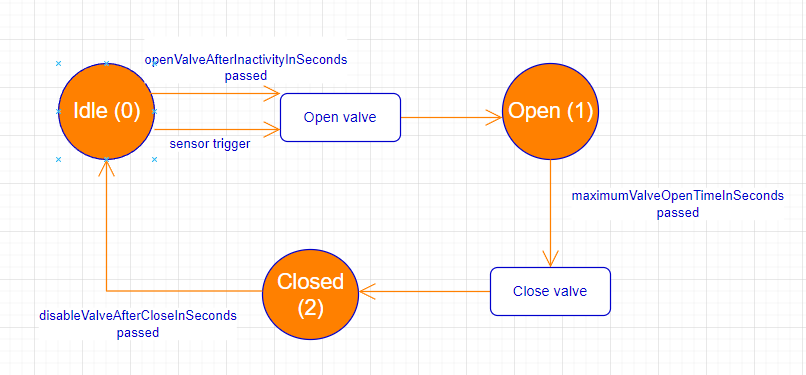

# ESP32 PIR and valve

## Components
- ESP 32 TTGO
- 55 ohm resistor
- Green LED
- PIR (5 volt input, 3.3 volt output)
- Relais and valve

## Wiring Diagram

## State Diagram

## Installation
Use Arduino IDE.

- Install via library manager : TFT_eSPI
- Now find the file C:\Users\Anton\Documents\Arduino\libraries\TFT_eSPI\User_Setup_Select.h
- Comment out : //#include <User_Setup.h>           // Default setup is root library folder
- Uncomment: #include <User_Setups/Setup25_TTGO_T_Display.h>    // Setup file for ESP32 and TTGO T-Display ST7789V SPI bus TFT
- Save
- Set wifi ssid and password in the config.h file (note that it will connect to that network, not starting a new one)
- Upload SPIFFS data (Tools -> ESP32 Sketch Data Upload)
- Compile and run (Board:TTGO Lora32-OLED v1)

